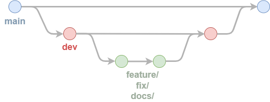

# Contributing Guidelines
Thank you for your interest in contributing to this ontology project! To ensure smooth collaboration, we follow a structured branching strategy, clear versioning rules, and contribution process. Please read these guidelines before starting work.

## Branching Strategy
This repository follows a **branching model** designed to balance ongoing development with stable releases. The key branches are:

### Main Branches

- **`main` (Stable)**  
    Contains the latest stable release. Only maintainers can directly modify `main`, and all changes must flow through `dev` and approved pull requests.
    - New ontology versions are tagged (e.g., `v1.0.0`) and released from `main`.
    - Ontology files for each tagged release are published to the `gh-pages` branch under `versions/`.

- **`dev` (Development)**  
    The primary branch for active development. All new features, bug fixes, and documentation updates are merged into `dev`.

---

### Short-lived Branches

- **`feature/<description>`**  
    For new features, ontology terms, or enhancements. These branches start from `dev` and are merged back into `dev` via pull requests.

- **`fix/<description>`**  
    For bug fixes or corrections to the ontology or documentation. These branches also start from `dev`.

- **`docs/<description>`**  
    For major documentation changes, such as updating the user guide or contributing guidelines. These branches also start from `dev`.

---

### Branching Diagram




## Contribution Workflow
1. **Fork the Repository.** External contributors should fork the repository into their own GitHub account.
2. **Create a New Branch.** Name your branch according to the conventions:

| Type          | Example                        |
|---------------|--------------------------------|
| Feature       | feature/add-electrode-terms    |
| Bug Fix       | fix/incorrect-labels           |
| Documentation | docs/update-contributor-guide  |

Feature and fix branches should start from dev. Hotfix branches (critical bug fixes for stable releases) should start from main.
3. **Make Changes.** Follow the ontology modeling guidelines (terminology, structure, annotations). Commit changes with clear, descriptive commit messages. Include tests, examples, or documentation if relevant.
4. **Open a Pull Request.** Push your branch to GitHub. Open a pull request (PR) targeting dev. Use the pull request template (if available) and provide a clear description of the change.
5. **Review and Merge.** Maintainers will review your PR. You may be asked to make revisions. Once approved, the branch will be merged into dev.

## Versioning Rules

This ontology follows **Semantic Versioning (SemVer)** principles, adapted for ontology evolution. The rules are:

### Major version bump (X.0.0)
Significant changes to the ontology's underlying conceptualizations. This includes:
- Structural overhauls.
- Deep changes to class hierarchies.
- Renaming major concepts.

### Minor version bump (X.Y.0)
Changes that affect:
- **`prefLabels`**.
- **Class or property IRIs** (which can break existing data using those IRIs).
- Addition of new major concepts or sections.

### Patch version bump (X.Y.Z)
Minor updates that do **not** break existing data, such as:
- Adding non-breaking properties.
- Adding new terms without changing existing `prefLabels` or IRIs.
- Correcting typos, improving elucidations, or adding synonyms.
- Updating documentation only.

### Key Rule of Thumb
- If the change could break existing data, it requires at least a **minor** version bump.
- If the change could break tools parsing the ontology (due to moved or renamed terms), it likely requires a **major** version bump.

## Commit Message Guidelines
Use clear, descriptive commit messages. Recommended format:

```
[Type] Short description (optional issue number)

Longer description (if needed).
```

Recommended values for `Type` are:
- `feature:` for new features.
- `fix:` for bug fixes.
- `docs:` for documentation changes.
- `chore:` for maintenance tasks.
- `refactor:` for code restructuring.

Example:
```
[feature] Add term for zinc-air battery (#42)

Added classes and properties to describe zinc-air battery electrodes, including new manufacturing terms.
```

## Communication
- For major changes, open an issue first to gather feedback before implementation.
- Use GitHub issues for discussions, bug reports, and feature requests.
- Use draft pull requests if you want early feedback.
