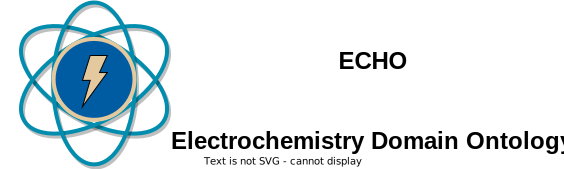

[](https://foops.linkeddata.es/FAIR_validator.html)


[](http://github.com/badges/stability-badges)  

[](https://zenodo.org/badge/latestdoi/570454941)  

<!-- markdownlint-disable MD033 -->
# Electrochemistry Domain Ontology



<!-- [](https://github.com/emmo-repo/domain-electrochemistry/actions/) -->
The Electrochemistry Domain Ontology is a domain of the [Elementary Multiperspective Materials Ontology (EMMO)][1], for describing electrochemical systems, materials, methods, and data. Its primary objective is to support the creation of [FAIR](https://www.go-fair.org/fair-principles/), [Linked Data](https://en.wikipedia.org/wiki/Linked_data) within the field of electrochemistry. This ontology serves as a foundational resource for harmonizing electrochemical knowledge representation, enhancing data interoperability, and accelerating progress in electrochemical research and development.  

Reference documentation is available [here](https://emmo-repo.github.io/domain-electrochemistry/index.html).

# Quick Start

Here is some information to help you get started working with the ontology in python and creating you own instances of Linked Data. For more information, please see the [Getting Started](https://emmo-repo.github.io/domain-electrochemistry/pages/getstarted.html) and [Examples](https://emmo-repo.github.io/domain-electrochemistry/pages/examples.html) section of the documentation. 

## Protégé

Protege is a open-source graphical editor for exploring and editing ontologies. You can explore the pre-inferred ontology in a [web-based instance](https://webprotege.stanford.edu/#projects/1f6fd01b-b127-4bc0-a998-ee269797be87/edit/Classes) (requires registering for a free account). Some suggested entry points for new users are:  
- [ElectrochemicalCell](https://webprotege.stanford.edu/#projects/1f6fd01b-b127-4bc0-a998-ee269797be87/edit/Classes?selection=Class(%3Chttps://w3id.org/emmo/domain/electrochemistry%23electrochemistry_6f2c88c9_5c04_4953_a298_032cc3ab9b77%3E))
- [Electrode](https://webprotege.stanford.edu/#projects/1f6fd01b-b127-4bc0-a998-ee269797be87/edit/Classes?selection=Class(%3Chttps://w3id.org/emmo/domain/electrochemistry%23electrochemistry_0f007072_a8dd_4798_b865_1bf9363be627%3E))
- [Electrolyte](https://webprotege.stanford.edu/#projects/1f6fd01b-b127-4bc0-a998-ee269797be87/edit/Classes?selection=Class(%3Chttps://w3id.org/emmo/domain/electrochemistry%23electrochemistry_fb0d9eef_92af_4628_8814_e065ca255d59%3E))  

You can also [download a local copy](https://protege.stanford.edu/) to explore the ontology on your machine.

## Python
There are two common ways to work with the ontology in python: loading the ontology as a graph using [rdflib](https://rdflib.readthedocs.io/en/stable/) or exploring the content of the ontology using [EMMOntoPy](https://github.com/emmo-repo/EMMOntoPy). Examples of both are provided below.

### rdflib
In [rdflib](https://rdflib.readthedocs.io/en/stable/), you can import the ontology as a graph, e.g. to run SPARQL queries:

```python
from rdflib import Graph

# Define the IRI of the ontology
echo = "https://w3id.org/emmo/domain/electrochemistry"

# Create an empty graph
g = Graph()

# Load the ontology from the IRI
g.parse(echo, format="ttl")

# Print the number of triples in the graph
print(f"Graph has {len(g)} triples.")
```
### EMMOntoPy
In [EMMOntoPy](https://github.com/emmo-repo/EMMOntoPy), you can choose to import the ontology directly from the web:

```python
from ontopy import get_ontology

# Loading from web
echo = get_ontology('https://w3id.org/emmo/domain/electrochemistry').load()
```

## Usage

This domain ontology supports the creation of Linked Data in any RDF-supported format. Below is an example using [JSON-LD](https://json-ld.org/) to desecribe a zinc foil electrode with some creator information and properties. Please see the documentation for [more examples](https://emmo-repo.github.io/domain-electrochemistry/pages/examples.html). 

```json
{
    "@context": "https://w3id.org/emmo/domain/electrochemistry/context",
    "@type": "Electrode",
    "schema:manufacturer": {
       "@type": "schema:ResearchOrganization",
       "@id": "https://www.wikidata.org/wiki/Q3041255",
       "schema:name": "SINTEF"
    },
    "schema:creator": {
       "@type": "schema:Person",
       "@id": "https://orcid.org/0000-0002-8758-6109",
       "schema:name": "Simon Clark"
    },
    "hasActiveMaterial": {
       "@type": ["Zinc", "Foil"]
    },
    "hasProperty": [
       {
             "@type": ["SpecificCapacity", "MeasuredProperty"],
             "hasNumericalPart": {
                "@type": "Real",
                "hasNumericalValue": 800
             },
             "hasMeasurementUnit": "emmo:MilliAmpereHourPerGram"
       },
       {
             "@type": ["Thickness", "ConventionalProperty"],
             "hasNumericalPart": {
                "@type": "Real",
                "hasNumericalValue": 250
             },
             "hasMeasurementUnit": "emmo:MicroMetre"
       },
       {
             "@type": ["Diameter", "MeasuredProperty"],
             "hasNumericalPart": {
                "@type": "Real",
                "hasNumericalValue": 2
             },
             "hasMeasurementUnit": "emmo:CentiMetre"
       },
       {
             "@type": ["Mass", "MeasuredProperty"],
             "hasNumericalPart": {
                "@type": "Real",
                "hasNumericalValue": 2.5
             },
             "hasMeasurementUnit": "emmo:Gram"
       }
    ]
}
```
This data can be read into an RDF graph and queried using SPARQL. For example, the following SPARQL query retrieves the value and unit for the diameter of the electrode:
```sparql
SELECT ?diameterValue ?measurementUnit
WHERE {
  ?electrode a <{echo.Electrode.iri}> ;
             <{echo.hasProperty.iri}> ?property .

  ?property a <{echo.Diameter.iri}> ;
            <{echo.hasNumericalPart.iri}> ?numericalPart ;
            <{echo.hasMeasurementUnit.iri}> ?measurementUnit .

  ?numericalPart <{echo.hasNumericalValue.iri}> ?diameterValue .
}
```
and returns the result:
```
2 https://w3id.org/emmo#CentiMetre
```
## Reference IRIs

The table below contains a quick cheat sheet of IRIs for accessing different files from the ontology
The import structure is summarized in the following table:

| IRI                                                            | Description                   |
| -------------------------------------------------------------- | ----------------------------- |
| `https://w3id.org/emmo/domain/electrochemistry`                | Base Asserted Ontology*       |
| `https://w3id.org/emmo/domain/electrochemistry/inferred`       | Base Pre-Inferred Ontology*   |
| `https://w3id.org/emmo/domain/electrochemistry/latest`         | Latest Asserted Ontology*     |
| `https://w3id.org/emmo/domain/electrochemistry/source`         | Source of Asserted Ontology*  |
| `https://w3id.org/emmo/domain/electrochemistry/context`        | Latest JSON-LD Context File   |
| `https://w3id.org/emmo/domain/electrochemistry/{VERSION}`      | Version of Asserted Ontology* |
| `https://w3id.org/emmo/domain/electrochemistry/{VERSION}/...`  | ... follows same logic above  |

*IRI directs to human readable documentation if called from the web browser and to the source .ttl file if called from an application.

# Acknowledgements


This project has received support from European Union research and innovation programs, under grant agreement numbers:

* [957189 - BIG-MAP](http://www.big-map.eu/)
* [101104022 - Battery2030+](https://battery2030.eu/)

[1]: https://github.com/emmo-repo/EMMO
[2]: https://www.big-map.eu
