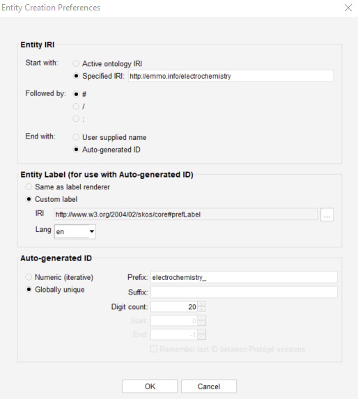

<!-- markdownlint-disable MD033 -->

# Electrochemistry Domain Ontology

<!-- [](https://github.com/emmo-repo/domain-electrochemistry/actions/) -->

An electrochemistry domain ontology developed in the [BIG-MAP][2] project.
The ontology is a part of the [Battery Interface Domain Ontology (BattINFO)](https://github.com/BIG-MAP/BattINFO).

The ontology is based on [EMMO][1].

A reference documentation of the individual classes is available in [html](https://emmo-repo.github.io/domain-electrochemistry/index.html) and [pdf](https://emmo-repo.github.io/domain-electrochemistry/electrochemistry.pdf) formats.

## Obtaining the ontology

The correct path to the inferred verion `emmo-inferred` is specified in the catalog file, [`catalog-v001.xml`](catalog-v001.xml).

The domain ontology is obtained with:

```console
git clone https://github.com/emmo-repo/domain-electrochemistry.git
```

When opening electrochemistry.ttl in Protégé, the correct versions of EMMO and other ontology dependencies will be downloaded and imported.

In [EMMOntoPy](https://github.com/emmo-repo/EMMOntoPy), correct import is obtained with:

```python
from ontopy import get_ontology

# Loading from local repository
electrochemistry = get_ontology('/path/to/domain-electrochemistry/electrochemistry.ttl').load(url_from_catalog=True)

# Loading from web
electrochemistry = get_ontology('https://raw.githubusercontent.com/emmo-repo/domain-electrochemistry/master/electrochemistry.ttl').load()
```

## Contributing to the ontology

There are two ways you can contribute to the ontology.

### Suggest minor changes on existing elements

[Create a feature request](https://github.com/emmo-repo/domain-electrochemistry/issues/new) in a [Github Issue](https://docs.github.com/en/issues/tracking-your-work-with-issues/creating-an-issue) to suggest edits to names, defintions, references on existing classes and properties.

### Propose additions/deletion of elements

> **_NOTE:_**  We recommend contacting some of [BattINFO](https://github.com/BIG-MAP/BattINFO) contributors in advance to discuss which additions deletions you wish to make.  

We recommend using the [forking workflow](https://www.atlassian.com/git/tutorials/comparing-workflows/forking-workflow) to contribute additions/deletions.
Fork this repository, clone the fork on your local PC, create your branch based on the existing `dev` branch (e.g. `dev_john_doe`) and work on the editions in you local copy.

You can edit ontologes in two main ways.
One is programmatically, using for instance [EMMOntoPy](https://github.com/emmo-repo/EMMOntoPy).
The second and more common is using the interface provided by the Protégé software.
In case of the latter, [install Protégé](https://protege.stanford.edu/) and use it to open the ontology file you wish to edit.
Before adding elements, ensure Prot´égé is configured to create IRIs in the right format:

* Open Protégé
* Go to File/Open and load the ontology file you wish to modify
* Go to File/Preferences and there go to the New Entities Tab
* Ensure you have configured the preferences as shown below:

    
  Here is the "Specified IRI" for you to copy: ```https://emmo.info/electrochemistry#```

* Once you have made your changes, commit them to your fork and [create a pull request](https://docs.github.com/en/pull-requests/collaborating-with-pull-requests/proposing-changes-to-your-work-with-pull-requests/creating-a-pull-request).
* We will merge the request after assessing it.

## Attributions and credits

### Contributors

* Simon Clark, SINTEF, Norway
* Eibar Flores, SINTEF, Norway
* Francesca Lønstad Bleken, SINTEF, Norway
* Jesper Friis, SINTEF, Norway
* Casper Welzel Andersen, SINTEF, Norway
* Martin Uhrin, EPFL, Switzerland
* Simon Stier, Fraunhofer, Germany
* Marek Marcinek, Warsaw University of Technology, Poland
* Anna Szczesna, Warsaw University of Technology, Poland
* Miran Gaberscek, National Institute of Chemistry, Slovenia
* Deyana Stoytcheva, ICMAB, Spain
* Rosa Palacin, ICMAB, Spain
* Ingeborg-Helene Svenum, SINTEF, Norway
* Inga Gudem Ringdalen, SINTEF, Norway
* Emanuele Farhi, SOLEIL synchrotron, France

### Projects

* [BIG-MAP](http://www.big-map.eu/); Grant Agreement No: 957189 

## License

The Battery Interface Domain Ontology is released under the [Creative Commons Attribution 4.0 International](https://creativecommons.org/licenses/by/4.0/legalcode) license (CC BY 4.0).

[1]: https://github.com/emmo-repo/EMMO
[2]: https://www.big-map.eu
