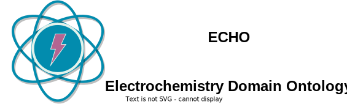
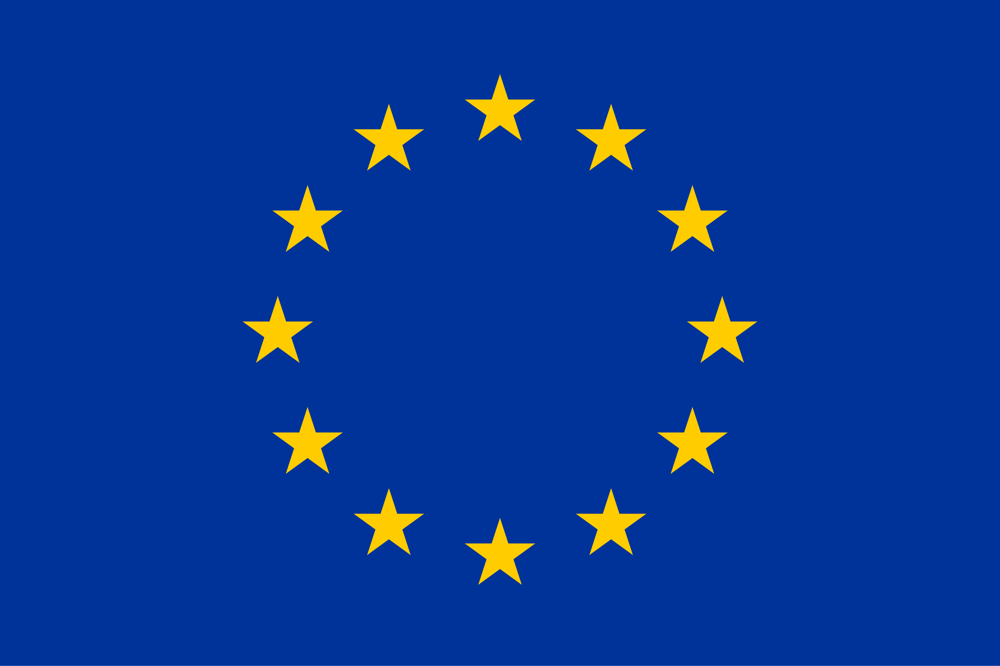

[](https://zenodo.org/badge/latestdoi/570454941)

<!-- markdownlint-disable MD033 -->
# Electrochemistry Domain Ontology



<!-- [](https://github.com/emmo-repo/domain-electrochemistry/actions/) -->
The Electrochemistry Domain Ontology is a domain of the Elementary Multiperspective Materials Ontology [(EMMO)][1], for describing electrochemical systems, materials, methods, and data. Its primary objective is to support the creation of [FAIR](https://www.go-fair.org/fair-principles/), [Linked Data](https://en.wikipedia.org/wiki/Linked_data) within the field of electrochemistry. This ontology serves as a foundational resource for harmonizing electrochemical knowledge representation, enhancing data interoperability, and accelerating progress in electrochemical research and development.

Reference documentation is available [here](https://emmo-repo.github.io/domain-electrochemistry/index.html).

# Quick Start

Here is some information to help you get started working with the ontology in python and creating you own instances of Linked Data. For more information, please see the Getting Started and Examples section of the documentation. 

## Python
There are two common ways to work with the ontology in python: loading the ontology as a graph using [rdflib](https://rdflib.readthedocs.io/en/stable/) or exploring the content of the ontology using [EMMOntoPy](https://github.com/emmo-repo/EMMOntoPy). Examples of both are provided below.

### rdflib
In [rdflib](https://rdflib.readthedocs.io/en/stable/), you can import the ontology as a graph, e.g. to run SPARQL queries:

```python
from rdflib import Graph

# Define the IRI of the ontology
echo = "https://w3id.org/emmo/domain/electrochemistry"

# Create an empty graph
g = Graph()

# Load the ontology from the IRI
g.parse(echo, format="ttl")

# Print the number of triples in the graph
print(f"Graph has {len(g)} triples.")
```
### EMMOntoPy
In [EMMOntoPy](https://github.com/emmo-repo/EMMOntoPy), you can choose to import the ontology directly from the web:

```python
from ontopy import get_ontology

# Loading from web
echo = get_ontology('https://w3id.org/emmo/domain/electrochemistry').load()
```

## Usage

This domain ontology supports the creation of Linked Data in any RDF-supported format. Below is an example using [JSON-LD](https://json-ld.org/) to desecribe a zinc foil electrode with some creator information and properties. Please see the documentation for [more examples](https://emmo-repo.github.io/domain-electrochemistry/pages/examples.html). 

```json
{
    "@context": "https://w3id.org/emmo/domain/electrochemistry/context",
    "@type": "Electrode",
    "schema:manufacturer": {
       "@type": "schema:ResearchOrganization",
       "@id": "https://www.wikidata.org/wiki/Q3041255",
       "schema:name": "SINTEF"
    },
    "schema:creator": {
       "@type": "schema:Person",
       "@id": "https://orcid.org/0000-0002-8758-6109",
       "schema:name": "Simon Clark"
    },
    "hasActiveMaterial": {
       "@type": ["Zinc", "Foil"]
    },
    "hasProperty": [
       {
             "@type": ["SpecificCapacity", "MeasuredProperty"],
             "hasNumericalPart": {
                "@type": "Real",
                "hasNumericalValue": 800
             },
             "hasMeasurementUnit": "emmo:MilliAmpereHourPerGram"
       },
       {
             "@type": ["Thickness", "ConventionalProperty"],
             "hasNumericalPart": {
                "@type": "Real",
                "hasNumericalValue": 250
             },
             "hasMeasurementUnit": "emmo:MicroMetre"
       },
       {
             "@type": ["Diameter", "MeasuredProperty"],
             "hasNumericalPart": {
                "@type": "Real",
                "hasNumericalValue": 2
             },
             "hasMeasurementUnit": "emmo:CentiMetre"
       },
       {
             "@type": ["Mass", "MeasuredProperty"],
             "hasNumericalPart": {
                "@type": "Real",
                "hasNumericalValue": 2.5
             },
             "hasMeasurementUnit": "emmo:Gram"
       }
    ]
}
```

## Structure and Integration with EMMO

The Electrochemistry Domain Ontology is an official domain on the EMMO. The asserted source consists of two files:
- `electrochemistry.ttl`: describes terms and object properties for the electrochemistry domain.
- `electrochemicalquantities.ttl`: describes the physical quantities related to the electrochemistry domain. It is encapsulated to allow it to be imported by other EMMO domains without needing to import the entire ontology.

The electrochemistry domain also imports other EMMO domains:
- [Chemical Substance Domain Ontology](https://github.com/emmo-repo/domain-chemical-substance): provides material annotations for electrochemical (meta)data.

The import structure is summarized in the following table:
| Imported Ontologies | Version           |
| ------------------- | ----------------- |
| EMMO                | 1.0.0-beta5       |
| chemical-substance  | 0.2.0-alpha       |

For simplicity, we complie the source files and other imports into a [pre-inferred ontology](inferred_version/electrochemistry-inferred.ttl). This is the result of running the asserted source files through a semantic reasoner and includes both asserted and inferred properties in a clear graph. 

### Acknowledgements



This project has received support from European Union research and innovation programs, under grant agreement numbers:

* 957189 - [BIG-MAP](http://www.big-map.eu/) 

## License

The Battery Interface Domain Ontology is released under the [Creative Commons Attribution 4.0 International](https://creativecommons.org/licenses/by/4.0/legalcode) license (CC BY 4.0).

[1]: https://github.com/emmo-repo/EMMO
[2]: https://www.big-map.eu
