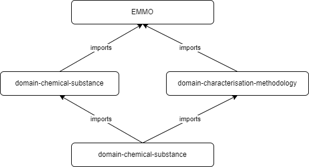
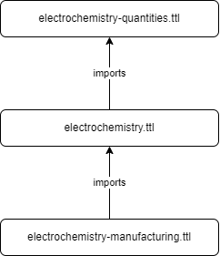

Ontology Structure
------------------

The electrochemistry ontology is structured as a domain within the EMMO universe. It also interacts with other domains including the ontologies for chemical substances and characterisation methodology. The import structure is depicted in the following figure. 

The domain ontology itself is also built using a modular structure. Aspects of the ontology which can be encapsulated and re-used independetly are structured into their own sub-domains. This structure is shown in the following figure. 

The electrochemistry domain ontology is also a foundational component of related domains like domain-battery. 

Versioning
~~~~~~~~~~

The versioning of the ontology follows the recommendations from EMMO to use `semantic versioning scheme <https://semver.org/>`__. Given a version number MAJOR.MINOR.PATCH, increment the:

1. MAJOR version when you make incompatible API changes
2. MINOR version when you add functionality in a backward compatible manner
3. PATCH version when you make backward compatible bug fixes

Additional labels for pre-release and build metadata are available as extensions to the MAJOR.MINOR.PATCH format.
