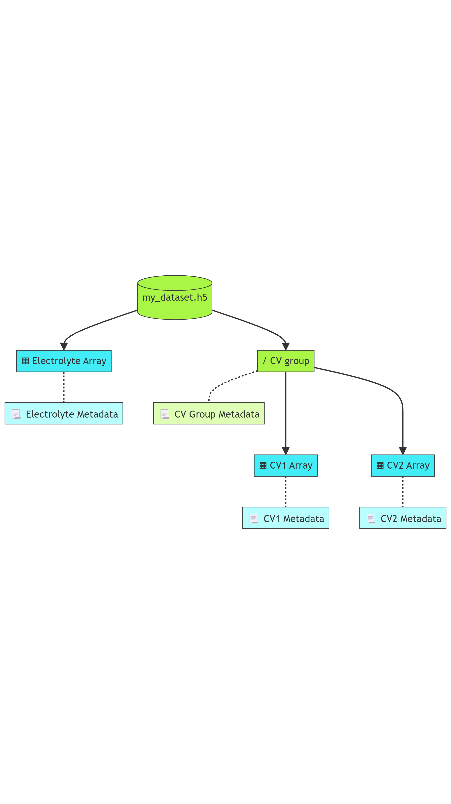

HDF5 files
==========

HDF5 files organize hierarchical data as a tree of groups and arrays, using a binary format optimized for distributed rapid access. 

Step 1: Describe Bibliographic and Governance metadata
~~~~~~~~~~~~~~~~~~~~~~~~~~~~~~~~~~~~~~~~~~~~~~~~~~~~~~

Start the JSON-LD description with the context and type, and add bibliographic and governance metadata as in [LINK TO METADATA SECTION]. 

.. code-block:: json

      {
        "@context": "https://w3id.org/emmo/domain/electrochemistry/context",
        "@type": "Dataset",
        "@id": "https://doi.org/10.5281/zenodo.13318553", 
        "dc:title": "Lithium Ion Battery Test Dataset",
        ...

      }

Step 2: Describe technical and domain metadata
~~~~~~~~~~~~~~~~~~~~~~~~~~~~~~~~~~~~~~~~~~~~~~~

Continue with technical and domain metadata as in [LINK TO METADATA SECTION]. 

.. code-block:: json

      {
      "schema:contentSize": "13.9 GB",
      "schema:encodingFormat": "application/x-hdf5"
      "@reverse": {
            "hasOutput": {"@type": "CyclicVoltammetry"}
        }

      }

Step 3: Describe the file contents
~~~~~~~~~~~~~~~~~~~~~~~~~~~~~~~~~~

HDF5 files are more abstract, so lets visualize first an example hierarchy as prologe for describing its contents.

The root of our example HDF5 file (``my_dataset.h5``) branches into an array (``"Electrolyte Array"``) and a group (``"CV group"``) storing a couple of Cyclic Voltammetry datasets (``"CV1 Array"``, ``"CV2 Array"``). Each node in the tree -Arrays and groups- have metadata associated to them. 

We recreate this hierarchy in JSON-LD by nesting objects using the ``"hasPart"`` attribute from the DCAT vocabulary. Groups are described as ``"@type:":"dcat:DatasetSeries"`` while arrays are described as ``"@type:":"dcat:Dataset"``. 

We also prefer keeping flat the metadata of each group and array; in other words, we keep key:value pairs of an Array at the ``"dcat:Dataset"`` level, and the key:value pairs of a Group at the ``"dcat:DatasetSeries"`` level. Flat metadata fields are exemplified as ``"metadata-field-#": "x-metadata-field-#"`` below. Keeping metadata flat at the node it describes renders a more readable JSON-LD file.

[MISSING: HOW TO DESCRIBE THE QUANTITIES STORED IN ARRAYS]

.. code-block:: json

      "hasPart": [
        {
            "@type": "dcat:Dataset",
            "name": "Electrolyte Array",
            "description": "Array containing electrolyte data.",
            "array-metadata-field-1": "array-metadata-value-1",
            "array-metadata-field-2": "array-metadata-value-2",
        },
        {
            "@type": "dcat:DatasetSeries",
            "name": "CV group",
            "description": "Group containing a series of CV measurements.",
            "group-metadata-field-1": "group-metadata-value-1",
            "group-metadata-field-2": "group-metadata-value-2",
            "hasPart": [
            {
                "@type": "dcat:Dataset",
                "name": "CV1 Array",
                "description": "First CV array.",
                "array-metadata-field-1": "array-metadata-value-1",
                "array-metadata-field-2": "array-metadata-value-2",
            },
            {
                "@type": "dcat:Dataset",
                "name": "CV2 Array",
                "description": "Second CV array.",
                "array-metadata-field-1": "array-metadata-value-1",
                "array-metadata-field-2": "array-metadata-value-2",
            }
            ]
        }        
        ]

Thats it, you have now to place metadata and file description together in a single JSON-LD and you complete your file description.