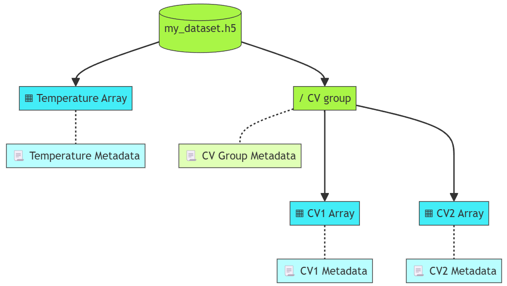

HDF5 files
==========

An HDF5 file serves as a container for two types of objects:  

* *datasets*: are collections of data organized in an array-like structure
* *groups*: function like folders to hold datasets and other groups. 

See the `Introduction to HDF5 files <https://support.hdfgroup.org/documentation/hdf5/latest/_intro_h_d_f5.html>`_ for more details. HDF5 files use a binary format optimized for distributed rapid access. Lets visualize first an example hierarchy as prologe for describing its contents.

HDF5 File Structure  
~~~~~~~~~~~~~~~~~~~

The root of our example file ``my_dataset.h5`` branches into an array ``"Temperature Array"`` and a group ``"CV group"`` storing a couple of Cyclic Voltammetry datasets ``"CV1 Array"`` and ``"CV2 Array"``. Each node in the tree -Arrays and groups- have metadata associated to them. We recreate this hierarchy in JSON-LD by nesting objects using the ``"hasPart"`` attribute from the DCAT vocabulary. 

Groups and datasets are identified with a **path naming convention** (see `HDF5 File Structure <https://support.hdfgroup.org/documentation/hdf5/latest/_h5_d_m__u_g.html#subsec_data_model_intro>`_). The root object, the file itself, is identified by ``"\"``. Subgroups and datasets branching from the root are separated with the back-slash: ``"/Group1/Subgroup3"``.  For our example: 
* The CV group's path name is: ``"/CV_group"``.
* The Electrolyte Array path name is: ``"/Electrolyte_Array"``.
* The CV1 Array is: ``"/CV_group/CV1_Array"``.  

Datasets have:  

* A *datatype*, which defines the kind of data stored in the array, e.g. ``string``, ``decimal``.
* A *quantity*, which could be a physical quantity such as Temperature, or non-physical such as Currency.
* Quantity *units*.
* *Indices (optional)*. An index is another array that specifies the position of an element within a particular dimension of the original array. Indices are useful when arrays are ordered. For instance, a 1D array with a quantity evolving in time, can be linked to another array with time values. A 2D array with a map of a quantity in a plane can be linked to a 1D array with spatial positions in *x*, and to another 1D array with spatial positions in *y*. 

JSON-LD description of HDF5 Files  
~~~~~~~~~~~~~~~~~~~~~~~~~~~~~~~~~

We use  `Dublin Core <https://www.dublincore.org/specifications/dublin-core/dcmi-terms/>`_ and `Schema.org <https://schema.org/>`_ vocabularies to describe file metadata, and the  `HDF5 Ontology <http://purl.allotrope.org/ontologies/hdf5>`_ to describe the contents of the file.

Step 1: Describe Bibliographic and Governance metadata
~~~~~~~~~~~~~~~~~~~~~~~~~~~~~~~~~~~~~~~~~~~~~~~~~~~~~~

Start the JSON-LD description with: 

* Context and type. 
 * We add the HDF5 ontology with the prefix ``"hdf5"``.
* Bibliographic and governance metadata as in [LINK TO METADATA SECTION]. 

.. code-block:: json

      {
        "@context": {"":"https://w3id.org/emmo/domain/electrochemistry/context", 
        "hdf5":"http://purl.allotrope.org/ontologies/hdf5"},
        "@type": "Dataset",
        "@id": "https://doi.org/10.5281/zenodo.13318553", 
        "dc:title": "Lithium Ion Battery Test Dataset",
        ...

      }

Step 2: Describe technical and domain metadata
~~~~~~~~~~~~~~~~~~~~~~~~~~~~~~~~~~~~~~~~~~~~~~~

Continue with technical and domain metadata as in [LINK TO METADATA SECTION]. 

.. code-block:: json

      {
      "schema:contentSize": "13.9 GB",
      "schema:encodingFormat": "application/x-hdf5"
      "@reverse": {
            "hasOutput": {"@type": "CyclicVoltammetry"}
        },

      }

Step 3: Describe groups
~~~~~~~~~~~~~~~~~~~~~~~

Describe groups with:  

* A type ``"@type:":"hdf5:Group"``.
* An ID, using the HDF5 path names to identify objects. For instance ``"@id": "/CV_group"``.
* A ``"name"`` mapping to the name of the group.
* the HDF5 metadata associated to the group ``"group-metadata-key": "group-metadata-value"``.
 * Ensure each metadata key is a property in a controlled vocabulary. 

.. code-block:: json

      {
        "@type": "hdf5:Group",
        "@id": "/CV_group",
        "name": "CV group",
        "group-metadata-field-1": "group-metadata-value-1",
        "group-metadata-field-2": "group-metadata-value-2",
      }

Step 4: Describe arrays
~~~~~~~~~~~~~~~~~~~~~~~

Describe arrays with:  

* A type ``"@type:":"hdf5:Dataset"``.
* An ID, using the HDF5 path names to identify objects. For instance ``"@id": "/CV_group/CV1_Array"``.
* a ``"name"`` mapping to the name of the array.
* A datatype, using either  `HDF5 Datatypes <http://purl.allotrope.org/ontologies/hdf5>`_ or from the  `XML schema <https://www.w3.org/TR/xmlschema11-2/#built-in-primitive-datatypes>`_.
* Optional: The dimensions of the array, as an ordered list of objects pointing to other arrays sotring the indices of each dimension. 
* The metadata associated to the array ``"array-metadata-key": "array-metadata-value"``.
 * Ensure each metadata key is a property in a controlled vocabulary. 

.. code-block:: json

      {
        "@type": "hdf5:Dataset",
        "@id": "/CV_group/CV1_Array",
        "name": "CV1 Array",
        "hdf5:datatype":"float",
        "hasQuantity":"CellVoltage",
        "hasMeasurementUnit":"emmo:MilliVolt",
        "hdf5:dimensions": [
            {"@type": "hdf5:Dimension",
            "hdf5:linkedTo":"/CV_group/CV2_Array"}
        ]
        "array-metadata-field-1": "array-metadata-value-1",
        "array-metadata-field-2": "array-metadata-value-2",
      }

.. note::
      Some keys/values do not have prefix, because they have been already described in the  `battinfo context <https://raw.githubusercontent.com/BIG-MAP/BattINFO/refs/heads/master/context/context.json>`_. For instance, we use ``"float"``, instead of ``"xsd:float"`` because ``"xsd"`` is already specified in the context file.

JSON-LD for our example
^^^^^^^^^^^^^^^^^^^^^^^
Putting it all together:

.. code-block:: json

      "@context": {
            "":"https://w3id.org/emmo/domain/electrochemistry/context", 
            "hdf5":"http://purl.allotrope.org/ontologies/hdf5"
            },
      "@type": "Dataset",
      "@id": "https://doi.org/10.5281/zenodo.13318553", 
      "dc:title": "Lithium Ion Battery Test Dataset",

      "schema:contentSize": "13.9 GB",
      "schema:encodingFormat": "application/x-hdf5"
      "@reverse": {
            "hasOutput": {"@type": "CyclicVoltammetry"}
        },

      "hasPart": [
        {
            "@type": "hdf5:Dataset",
            "@id": "/Temperature_array",
            "name": "Temperature Array",
            "hdf5:datatype":"float",
            "hasQuantity":"AmbientThermodynamicTemperature",
            "hasMeasurementUnit":"emmo:DegreeCelsius",
            "hdf5:dimensions": null,
            "array-metadata-field-1": "array-metadata-value-1",
            "array-metadata-field-2": "array-metadata-value-2",
        },
        {
            "@type": "hdf5:Group",
            "@id": "/CV_group",
            "name": "CV group",
            "group-metadata-field-1": "group-metadata-value-1",
            "group-metadata-field-2": "group-metadata-value-2",
            "hasPart": [
            {
                  "@type": "hdf5:Dataset",
                  "@id": "/CV_group/CV1_Array",
                  "name": "CV1 Array",
                  "hdf5:datatype":"float",
                  "hasQuantity":"CellVoltage",
                  "hasMeasurementUnit":"emmo:MilliVolt",
                  "hdf5:dimensions": [
                        {"@type": "hdf5:Dimension",
                        "hdf5:linkedTo":"/CV_group/CV2_Array"}
                        ]
                  "array-metadata-field-1": "array-metadata-value-1",
                  "array-metadata-field-2": "array-metadata-value-2",
            },
            {
                  "@type": "hdf5:Dataset",
                  "@id": "/CV_group/CV2_Array",
                  "name": "CV2 Array",
                  "hdf5:datatype":"float",
                  "hasQuantity":"Duration",
                  "hasMeasurementUnit":"emmo:Second",
                  "hdf5:dimensions": null,
                  "array-metadata-field-1": "array-metadata-value-1",
                  "array-metadata-field-2": "array-metadata-value-2",
            },
            ]
        }        
        ]

Thats it, you have now to place metadata and file description together in a single JSON-LD and you complete your file description.