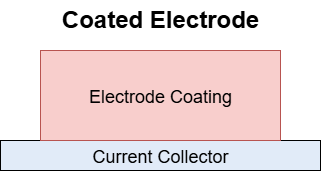

Electrodes
==========

An **electrode** is the component of an electrochemical system where oxidation and reduction reactions occur.  
Electrodes act as interfaces between electronic and ionic conductors — storing, releasing, or transferring charge during operation.

In the ontology, electrodes are represented as **physical objects** that can be decomposed into functional and structural subparts such as coatings, current collectors, and materials.

Common electrode types include:

- **Anode** — oxidation occurs here (negative during discharge).  
- **Cathode** — reduction occurs here (positive during discharge).  
- **Reference Electrode** — provides a stable reference potential in measurement cells.

Conceptual Structure
--------------------

An electrode typically consists of:

- **Current Collector** — conducts electrons to/from the external circuit.  
- **Coating** — the functional layer that includes:
  - **Active Material** — participates in electrochemical reactions.  
  - **Binder** — provides mechanical integrity.  
  - **Conductive Additive** — enhances electronic conductivity.  

   Example structure of a coated electrode.

Guidelines for Use
------------------

Follow these steps when describing an electrode:

1. Identify the Electrode
^^^^^^^^^^^^^^^^^^^^^^^^^

Start by selecting the appropriate class, such as `Electrode`, `Anode`, or `Cathode`.  
If the electrode has one or more coatings, use the subclasses `SingleCoatedElectrode` or `DoubleCoatedElectrode`.

.. code-block:: json

   {
     "@context": "https://w3id.org/emmo/domain/electrochemistry/context",
     "@type": "Electrode"
   }

2. Assign Properties
^^^^^^^^^^^^^^^^^^^^

Attach measurable or conventional properties using `hasProperty`.  
Common examples include **thickness**, **porosity**, **mass loading**, or **specific capacity**.

.. code-block:: json

   {
     "@context": "https://w3id.org/emmo/domain/electrochemistry/context",
     "@type": "Electrode",
     "hasProperty": [
       {
         "@type": "Thickness",
         "hasNumericalPart": {
           "@type": "RealData",
           "hasNumberValue": 50
         },
         "hasMeasurementUnit": "MicroMetre"
       }
     ]
   }

3. Define Structural Composition
^^^^^^^^^^^^^^^^^^^^^^^^^^^^^^^^

Link the electrode to its subparts using **domain-specific relations** such as:

- `hasCoating`
- `hasCurrentCollector`
- `hasActiveMaterial`
- `hasBinder`
- `hasAdditive`

These are **subproperties of `hasPart`**, which allows reasoning systems to automatically infer part–whole hierarchies.

Representation Patterns
-----------------------

Single Coated Electrode
^^^^^^^^^^^^^^^^^^^^^^^

A `SingleCoatedElectrode` has one functional coating on its current collector.

.. code-block:: json

   {
     "@context": "https://w3id.org/emmo/domain/electrochemistry/context",
     "@type": "SingleCoatedElectrode",
     "hasCoating": {
       "@type": "ElectrodeCoating",
       "hasActiveMaterial": { "@type": "LithiumIronPhosphate" },
       "hasBinder": { "@type": "PolyvinylideneFluoride" },
       "hasAdditive": { "@type": "CarbonBlack" }
     },
     "hasCurrentCollector": { "@type": ["Aluminium", "Foil"] },
     "hasProperty": [
       {
         "@type": "Thickness",
         "hasNumericalPart": { "@type": "RealData", "hasNumberValue": 75 },
         "hasMeasurementUnit": "MicroMetre"
       }
     ]
   }

This example describes a lithium iron phosphate (LFP) cathode with a single coating applied to an aluminium current collector. Note the current collector's type: combining `Aluminium` and `Foil` states both what it is made of and its physical form.

Double Coated Electrode
^^^^^^^^^^^^^^^^^^^^^^^

A `DoubleCoatedElectrode` has two coatings applied on opposite sides of the same current collector — a common configuration in both laboratory and commercial electrodes.

.. code-block:: json

   {
     "@context": "https://w3id.org/emmo/domain/electrochemistry/context",
     "@type": "DoubleCoatedElectrode",
     "hasCoating": [
       {
         "@type": "ElectrodeCoating",
         "hasActiveMaterial": { "@type": "LithiumNickelManganeseCobaltOxide811" },
         "hasBinder": { "@type": "PolyvinylideneFluoride" },
         "hasAdditive": { "@type": "CarbonBlack" }
       },
       {
         "@type": "ElectrodeCoating",
         "hasActiveMaterial": { "@type": "LithiumManganeseOxide" },
         "hasBinder": { "@type": "PolyvinylideneFluoride" },
         "hasAdditive": { "@type": "CarbonBlack" }
       }
     ],
     "hasCurrentCollector": { "@type": ["Aluminium", "Foil"] },
     "hasProperty": [
       {
         "@type": "Thickness",
         "hasNumericalPart": { "@type": "RealData", "hasNumberValue": 150 },
         "hasMeasurementUnit": "MicroMetre"
       }
     ]
   }

Here, the two coatings can represent different active materials or formulations applied to each side of the foil.  
This pattern can also be extended for gradient or layered electrodes.

Reasoning Implications
----------------------

Because `hasCoating`, `hasCurrentCollector`, `hasActiveMaterial`, etc. are all **subproperties of `hasPart`**, reasoning engines infer the general relation from the specific one:

.. code-block:: text

   If Electrode hasCoating Coating,
   then Electrode hasPart Coating.

A generic query for `hasPart` therefore retrieves coatings, current collectors, and materials without naming each specific relation. To follow the hierarchy through several levels (electrode to coating to material), traverse the part relations in your query.

Best Practices
--------------

- Use `Anode` and `Cathode` when polarity or reaction direction is known; use `Electrode` when not.  
- When modeling coatings, prefer `SingleCoatedElectrode` or `DoubleCoatedElectrode` subclasses for clarity.  
- Include `hasCurrentCollector` even for self-supporting electrodes to maintain consistency.  
- Use `hasCoating` to encapsulate active, binder, and additive materials.  
- Represent measurable properties like thickness or porosity through `hasProperty`.
- If you need to distinguish coating layers (base vs. top), define your own subclasses of `ElectrodeCoating` in an application ontology; the domain ontology deliberately does not name them.

Summary
-------

Electrodes link **chemical composition**, **geometric structure**, and **functional role** within electrochemical systems.  
The ontology captures this hierarchy through well-defined relations and specialized subclasses.

.. list-table::
   :header-rows: 1
   :widths: 32 38 30

   * - Concept
     - Relation
     - Example
   * - **Electrode**
     - `hasCoating`
     - functional layer of active material
   * - **SingleCoatedElectrode**
     - `hasCoating`
     - one coating on current collector
   * - **DoubleCoatedElectrode**
     - `hasCoating`
     - coatings on both sides
   * - **ElectrodeCoating**
     - `hasActiveMaterial`, `hasBinder`, `hasAdditive`
     - describes internal composition
   * - **Electrode**
     - `hasCurrentCollector`
     - connects to substrate foil

This structure allows for rich, reusable, and machine-interpretable descriptions of electrode architectures across different experimental, modeling, and manufacturing contexts.
