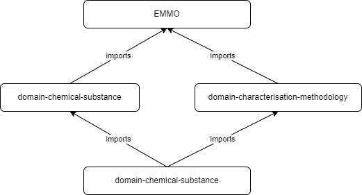
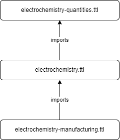

User Guide
==========

The Electrochemistry Domain Ontology (ECHO) provides a standardized vocabulary for describing electrochemical systems, materials, methods, and data. Whether you work with batteries, fuel cells, corrosion studies, or electroanalytical methods, the ontology helps you structure your data so that other researchers can understand your setup, software can process your results automatically, and findings from different experiments can be compared.

The ontology covers experimental setups (electrodes, cells, electrolytes), measurement techniques, physical quantities, materials, and the relationships between them. This guide shows how to use those terms to describe your own systems and data.

.. toctree::
   :maxdepth: 3
   :caption: User Guide

   Electrochemical Systems <electrochemical_systems/index>
   Testing <testing/index>
   Datasets <datasets/index>

Ontology Structure
------------------

The electrochemistry ontology is a domain ontology within the EMMO family. It builds on EMMO itself and imports the domain ontologies for chemical substances and characterisation methodology. The import structure is depicted in the following figure.

The ontology is built from modules. Aspects that can be encapsulated and re-used independently, such as manufacturing and testing, live in their own sub-domain modules. This structure is shown in the following figure.

The electrochemistry domain ontology is in turn a foundational component of related domains like `domain-battery <https://github.com/emmo-repo/domain-battery>`__.

Versioning
~~~~~~~~~~

The ontology follows the `semantic versioning scheme <https://semver.org/>`__ recommended by EMMO. Given a version number MAJOR.MINOR.PATCH, the:

1. MAJOR version increments on incompatible changes, such as removing or renaming classes and relations or changing IRIs
2. MINOR version increments when new classes, relations, or annotations are added in a backward compatible manner
3. PATCH version increments on backward compatible fixes, such as corrected annotations or definitions

Background Reading
------------------

This guide assumes basic familiarity with semantic-web concepts. These external resources cover the fundamentals better than we could here:

* `RDF 1.1 Primer <https://www.w3.org/TR/rdf11-primer/>`__, the W3C introduction to triples, IRIs, and graphs
* `JSON-LD 1.1 <https://www.w3.org/TR/json-ld11/>`__, the JSON serialization used in the examples throughout this guide
* `SPARQL 1.1 Query Language <https://www.w3.org/TR/sparql11-query/>`__ for querying RDF data
* `EMMO documentation <https://emmo-repo.github.io/>`__ for the top-level ontology this domain builds on
